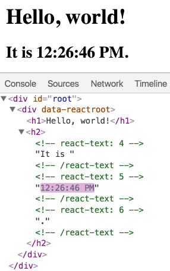

ធាតុផ្សំគឺជាប្លុកដែលតូចជាងគេបំផុតនៃកម្មវិធីReact។

ធាតុ(element)ពិពណ៌នាអំពីអ្វីដែលអ្នកចង់ឃើញនៅលើអេក្រង់:

```js
const element = <h1>Hello, world</h1>;
```

មិនដូចធាតុbrowser DOM, ធាតុ Reactគឺជាវត្ថុធម្មតាហើយងាយស្រួលក្នុងការដើម្បីបង្កើត។ React DOM យកចិត្តទុកដាក់ធ្វើឱ្យទាន់សម័យ DOM ដើម្បីផ្គូផ្គងធាតុ React ។

>**Note:**
>
>យើងអាចច្រឡំធាតុជាមួយនឹងគំនិតដែលគេស្គាល់កាន់តែច្រើនអំពី "components"។ យើងនឹងណែនាំ components នៅក្នុង [ផ្នែកបន្ទាប់](/docs/components-and-props.html). ធាតុគឺជាអ្វីដែលcomponentsត្រូវបាន "ធ្វើពី", ហើយយើងលើកជំរុញឱ្យអ្នកអានផ្នែកនេះមុនពេលលោតទៅផ្នែកបន្ទាប់។

## ការបង្ហាញធាតុទៅក្នុង DOM {#rendering-an-element-into-the-dom}

តោះនិយាយថាមាន `<div>` កន្លែងណាមួយនៅក្នុងឯកសារ HTML របស់អ្នក:

```html
<div id="root"></div>
```

យើងហៅវាថាជា "root" DOM node ពីព្រោះអ្វីគ្រប់យ៉ាងដែកនៅក្នុងវានឹងត្រូវបានគ្រប់គ្រងដោយ React DOM ។

កម្មវិធីដែលបានបង្កើតឡើងដោយគ្រាន់តែមានReactធម្មតាមាន root DOM តែមួយ។ ប្រសិនបើអ្នកកំពុងដាក់បញ្ចូលReactទៅក្នុងកម្មវិធីដែលមានស្រាប់ អ្នកប្រហែលជាអាចមាន root DOM ជាច្រើនទៅតាមចំណងចង់បានរបស់អ្នក។

ដើម្បីបង្ហាញធាតុReactទៅក្នុង root DOM សូមធ្វើការផ្តល់ទៅឱ្យ `ReactDOM.render()`:

`embed:rendering-elements/render-an-element.js`

[សាកល្បងវានៅលើ CodePen](codepen://rendering-elements/render-an-element)

វាបង្ហាញ "ជំរាបសួរពិភពលោក" នៅលើទំព័រនេះ។

## ធ្វើបច្ចុប្បន្នភាពធាតុបង្ហាញ {#updating-the-rendered-element}

React elements are [immutable](https://en.wikipedia.org/wiki/Immutable_object). Once you create an element, you can't change its children or attributes. An element is like a single frame in a movie: it represents the UI at a certain point in time.

ជាមួយនឹងចំណេះដឹងរបស់យើង, វិធីតែមួយគត់ដើម្បីធ្វើឱ្យ UI ទាន់សម័យគឺបង្កើតធាតុថ្មីt, ហើយបញ្ជូនវាទៅ `ReactDOM.render()`.

សូមពិចារណាអំពីគំរូម៉ោងនាឡិកានេះ:

`embed:rendering-elements/update-rendered-element.js`

[](codepen://rendering-elements/update-rendered-element)

It calls `ReactDOM.render()` every second from a [`setInterval()`](https://developer.mozilla.org/en-US/docs/Web/API/WindowTimers/setInterval) callback.

>**Note:**
>
>In practice, most React apps only call `ReactDOM.render()` once. In the next sections we will learn how such code gets encapsulated into [stateful components](/docs/state-and-lifecycle.html).
>
>We recommend that you don't skip topics because they build on each other.

## Reactធ្វើបច្ចុប្បន្នភាពអ្វីដែលចាំបាច់ប៉ុណ្ណោះ {#react-only-updates-whats-necessary}

React DOM compares the element and its children to the previous one, and only applies the DOM updates necessary to bring the DOM to the desired state.

You can verify by inspecting the [last example](codepen://rendering-elements/update-rendered-element) with the browser tools:



Even though we create an element describing the whole UI tree on every tick, only the text node whose contents has changed gets updated by React DOM.

In our experience, thinking about how the UI should look at any given moment rather than how to change it over time eliminates a whole class of bugs.
